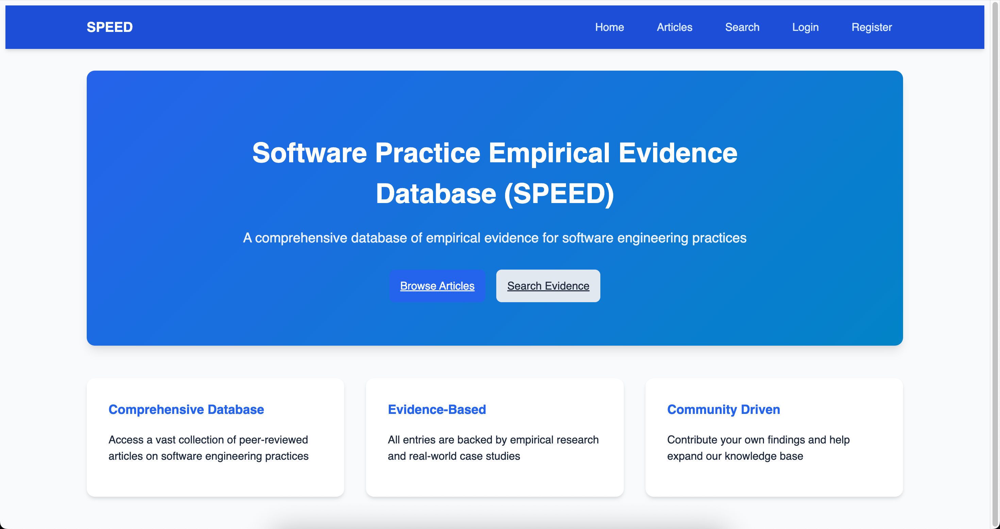
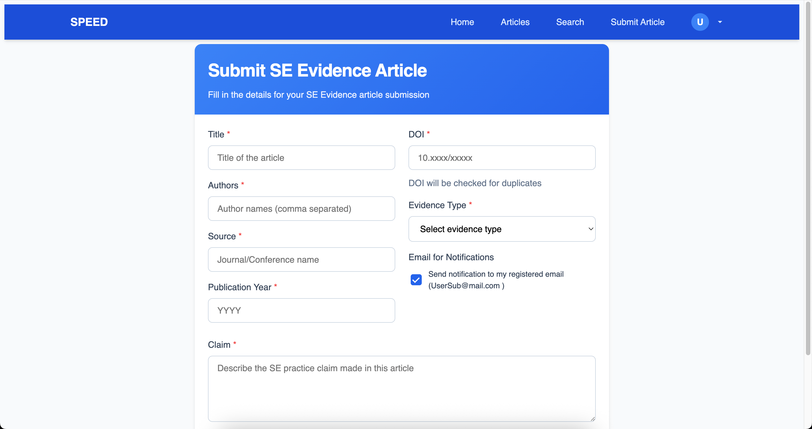
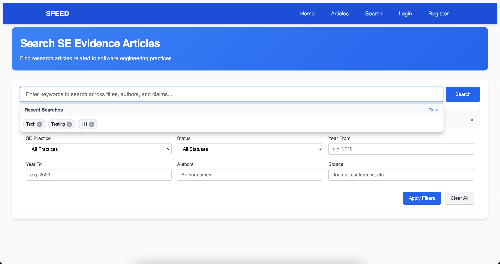
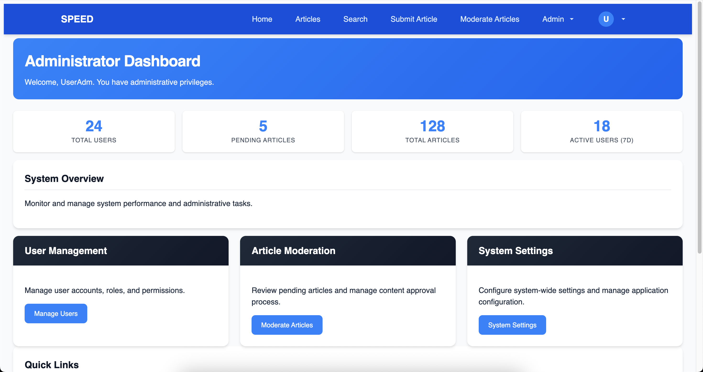
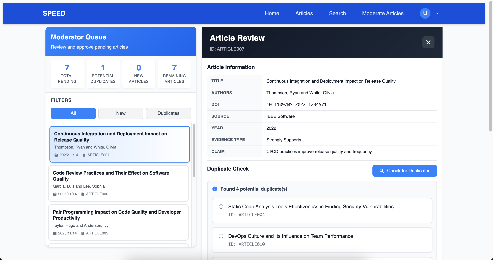
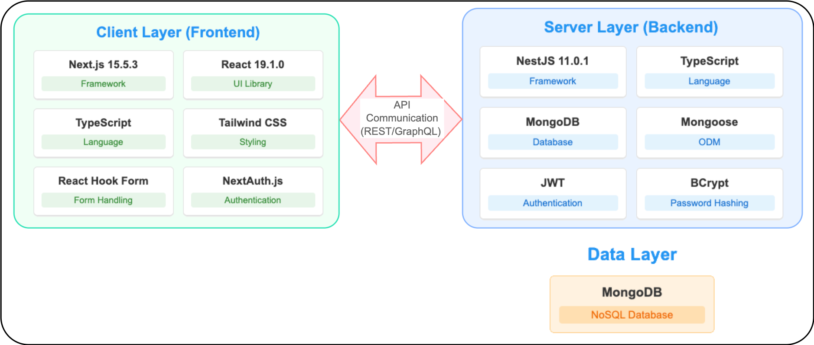
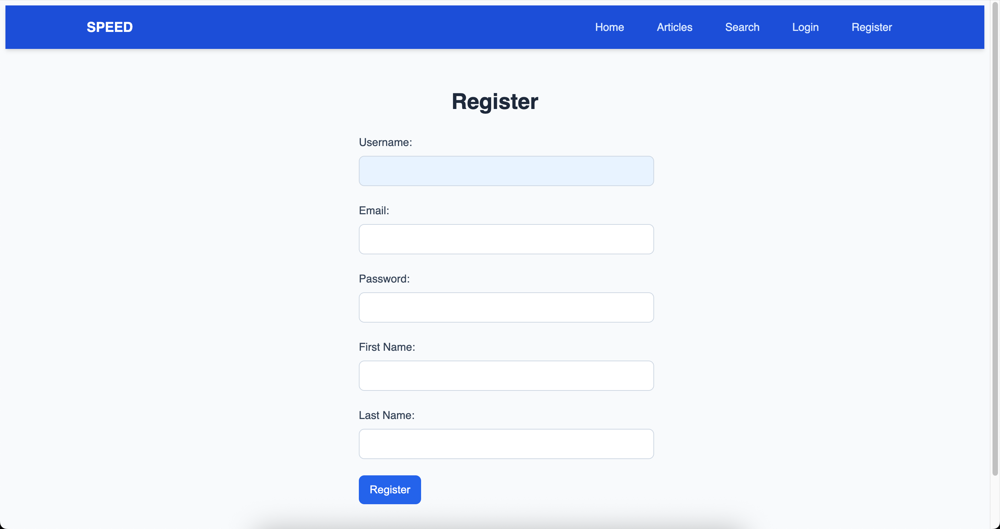
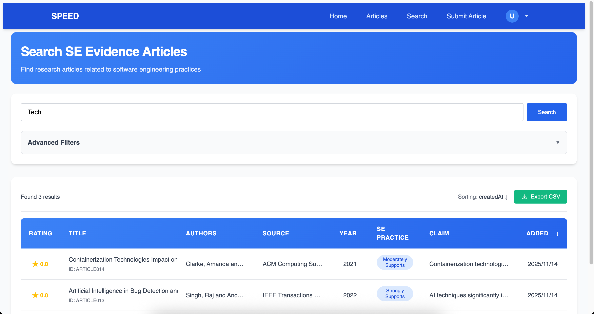
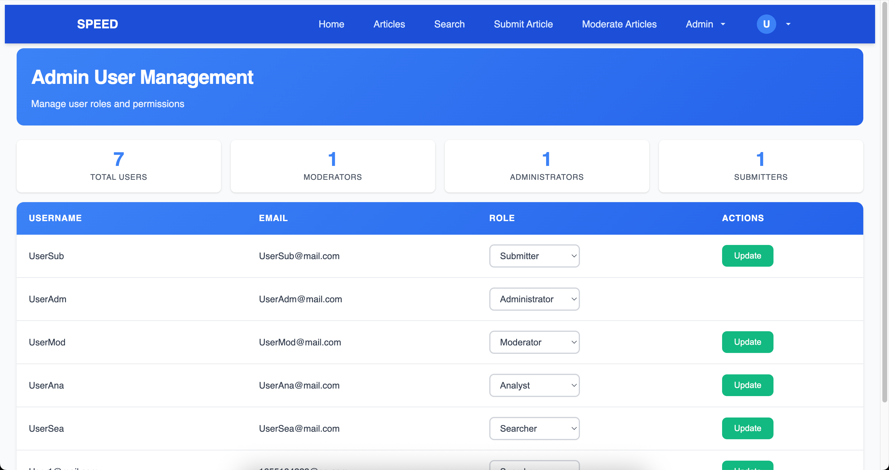

# CISE_SPEED - Software Practice Empirical Evidence Database (SPEED)

A full-stack web application designed as a searchable database of evidence about different claims regarding various Software Engineering (SE) practices. This platform allows researchers and practitioners to access, submit, and evaluate empirical evidence related to software engineering methodologies, tools, and practices.



## 🚀 Features

- **Article Submission**: Users can submit articles with empirical evidence about SE practices
- **Search Functionality**: Comprehensive search to find relevant evidence and studies
- **Rating System**: Users can rate articles to provide quality feedback
- **User Authentication**: Secure login/registration with role-based access
- **Role-based Access Control**: Different permissions for regular users, moderators, and administrators
- **Admin Dashboard**: Administrative tools for managing users and content
- **Moderation Queue**: Review system for submitted articles before publication
- **Duplicate Detection**: Automated system to identify potential duplicate submissions
- **Responsive Design**: Works seamlessly across devices and screen sizes

Here are visual representations of key features:






## 🛠️ Tech Stack

The application follows a modern full-stack architecture:



### Frontend
- **Next.js** (15.5.3) - React-based framework
- **React** (19.1.0) - UI library
- **TypeScript** (5.x) - Type safety
- **Tailwind CSS** (v4) - Utility-first CSS framework
- **Sass** - CSS extension language
- **CSS Modules** - Component-scoped styling
- **Formik & Yup** - Form management and validation
- **React Hook Form** - Alternative form management
- **React Icons** - UI icons
- **Next-Auth** - Authentication solution

### Backend
- **NestJS** (11.x) - Node.js framework
- **TypeScript** (5.x) - Type safety
- **MongoDB** - NoSQL database
- **Mongoose** - ODM (Object Document Mapper)
- **JWT** - Authentication tokens
- **BCrypt** - Password hashing
- **Nodemailer** - Email functionality
- **Class-validator & Class-transformer** - Validation
- **Jest** - Testing framework

## 📋 Prerequisites

- Node.js (v18 or higher)
- npm or yarn
- MongoDB (local instance or cloud service like MongoDB Atlas)

## 🛠️ Installation & Setup

### 1. Clone the Repository

```bash
git clone https://github.com/your-username/cise-speed.git
cd cise-speed
```

### 2. Set Up Environment Variables

Create a `.env` file in the `backend` directory with the following variables:

```env
DB_URI=mongodb://localhost:27017/cise_speed
JWT_SECRET=your-super-secret-jwt-key
JWT_EXPIRES_IN=24h
PORT=8082
FRONTEND_URL=http://localhost:3000
```

For the frontend, create a `.env.local` file in the `frontend` directory:

```env
NEXTAUTH_URL=http://localhost:3000
NEXTAUTH_SECRET=your-next-auth-secret
BACKEND_URL=http://localhost:8082
```

### 3. Install Dependencies

```bash
# Install backend dependencies
cd backend
npm install

# Install frontend dependencies
cd ../frontend
npm install
```

### 4. Start the Application

```bash
# Terminal 1: Start the backend server
cd backend
npm run start:dev

# Terminal 2: Start the frontend server
cd frontend
npm run dev
```

The application will be available at [http://localhost:3000](http://localhost:3000)

## 🔧 Running in Production

### Backend Production Build

```bash
cd backend
npm run build
npm run start:prod
```

### Frontend Production Build

```bash
cd frontend
npm run build
npm start
```

## 🧪 Testing

### Backend Tests

```bash
# Run unit tests
cd backend
npm run test

# Run end-to-end tests
npm run test:e2e

# Run tests in watch mode
npm run test:watch

# Generate coverage report
npm run test:cov
```

### Frontend Tests

```bash
# Run tests
cd frontend
npm run test

# Run tests in watch mode
npm run test:watch

# Generate coverage report
npm run test:coverage
```

## 🏗️ Project Structure

```
cise-speed/
├── backend/                      # NestJS API server
│   ├── src/
│   │   ├── api/                  # API modules (article, user)
│   │   │   ├── article/          # Article management
│   │   │   └── user/             # User management and auth
│   │   ├── controllers/          # Additional controllers
│   │   ├── services/             # Additional services
│   │   ├── app.module.ts         # Main application module
│   │   └── main.ts               # Entry point
│   └── package.json
├── frontend/                     # Next.js web application
│   ├── public/                   # Static assets
│   ├── src/
│   │   ├── components/           # React components
│   │   ├── contexts/             # React contexts (AuthContext)
│   │   ├── hooks/                # Custom React hooks
│   │   ├── pages/                # Next.js pages
│   │   ├── styles/               # Sass stylesheets and CSS modules
│   │   ├── types/                # TypeScript type definitions
│   │   └── utils/                # Utility functions
│   └── package.json
└── README.md
```

## 📖 Usage

### User Registration & Authentication
1. Visit the application homepage
2. Click on "Register" to create an account
3. Use your credentials to log in



### Submitting Articles
1. Log in to your account
2. Navigate to the "Submit Article" page
3. Fill out the comprehensive form with article details
4. Submit for review


### Searching Evidence
1. Use the search page to find articles by keywords, authors, or topics
2. Filter results by various criteria
3. Read and rate articles based on their quality and relevance



### Administration & Moderation
- Admins can manage users and content via the admin dashboard
- Moderators can review submitted articles in the moderation queue



## 🤝 Contributing

We welcome contributions to the CISE_SPEED project! Here's how you can help:

1. Fork the repository
2. Create a feature branch (`git checkout -b feature/amazing-feature`)
3. Make your changes
4. Commit your changes (`git commit -m 'Add amazing feature'`)
5. Push to the branch (`git push origin feature/amazing-feature`)
6. Open a Pull Request

### Development Guidelines

- Follow the TypeScript/JavaScript style guide used in the project
- Write tests for new functionality
- Maintain backward compatibility when possible
- Update documentation as needed
- Use meaningful commit messages

## 🐛 Issues & Support

If you encounter any issues or have questions about the project:

1. Check the existing [Issues](https://github.com/hexwarrior6/cise-speed/issues) to see if it's already reported
2. If not, open a new issue with detailed information about the problem
3. For feature requests, please open an issue describing the proposed feature

## 📄 License

This project is licensed under the MIT License - see the [LICENSE](LICENSE) file for details.

## 🙏 Acknowledgments

- Thanks to all contributors who have helped shape this project
- Special thanks to the open-source community for the amazing tools and libraries used in this project
- The research community for providing valuable feedback on the platform

## 📞 Contact

For questions or support regarding CISE_SPEED, please open an issue in the repository.
